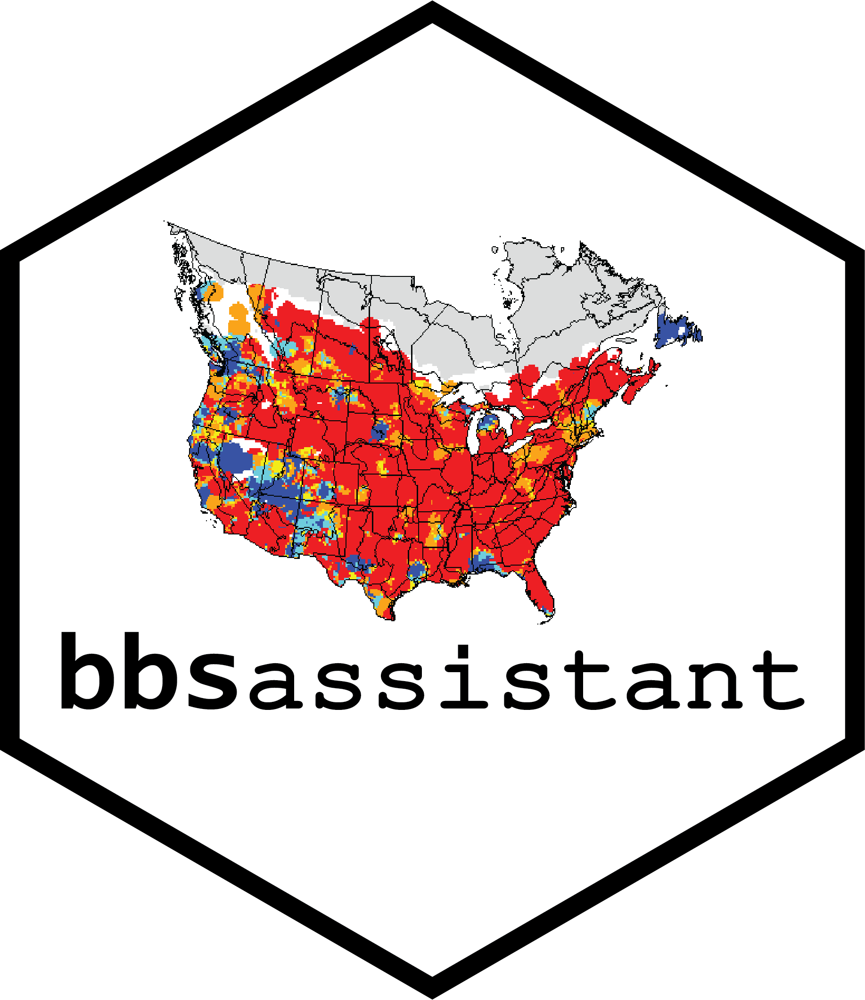

<!-- badges: start -->
[](https://doi.org/10.21105/joss.01768)
[](https://www.tidyverse.org/lifecycle/#maturing)

[](https://github.com/trashbirdecology/bbsAssistant/actions)
[](http://creativecommons.org/publicdomain/zero/1.0/)
[](#contributors)


<!-- [](https://travis-ci.org/trashbirdecology/bbsAssistant) -->
<!-- badges: end -->


## ALERT  
Due to changes in the location of the BBS observations and results datasets, this package is undergoing a transformation (written 2020-09-09). 

Currently (as of 2020-09-09), we are working on the following and in the following order:  

- Providing the most recent Sauer analysis results as data objects
- Updating the subsetting functions
- Functions for obtaining old observations dataset versions
- Functions for obtaining old analysis results
- Updating the taxonomic matching capacity
- Mapping and visualization features


## About
_This repository contains the development version of __bbsAssistant__. Please submit [Issues here](https://github.com/TrashBirdEcology/bbsAssistant/issues). Major releases will be pushed to the [this repository](https://github.com/usgs-biolab/bbsAssistant) and to the [USGS ScienceBase digital repository](https://www.sciencebase.gov/catalog/item/5de53a0fe4b02caea0e8fa72).

This R package contains functions for downloading, importing, and munging the the observations data and the analysis results from the [North American Breeding Bird Survey](https://www.pwrc.usgs.gov/bbs/) (BBS) [via USGS ScienceBase repository](https://sciencebase.gov/). This package was created to allow the user to bulk-download the BBS point count and related (e.g., route-level conditions) via the ScienceBase API (using [R package `sbtools`](https://cran.r-project.org/package=sbtools), and to quickly subset the data by taxonomic classifications, jurisdictional boundaries, and geospatial bounding boxes.

### Citations
__For the BBS dataset and analysis results__, call `citation("bbsAssistant")` or see library loading message.

__For general use of the R package bbsAssistant__ and/or __companion paper__:  
Burnett, J.L., Wszola, L., and Palomo-Muñoz, G. (2019). bbsAssistant: An R package for downloading and handling data and information from the North American Breeding Bird Survey: U.S. Geological Survey software release, https://doi.org/10.5066/P93W0EAW.

_or_ 

Burnett, J.L., Wszola, L., and Palomo-Muñoz, G. (2019). bbsAssistant: An R package for downloading and handling data and information from the North American Breeding Bird Survey. Journal of Open Source Software, 4(44), 1768, https://doi.org/10.21105/joss.01768

## Quick Start
### Installing __bbsAssistant__
Install the development version of this package using devtools and load the package and dependencies:
```{r install, echo=TRUE, warning=FALSE, message=FALSE, eval=FALSE}
devtools::install_github("trashbirdecology/bbsAssistant", 
                         ref="main", # ensure it pulls from the 'main' branch. Function may still default to 'master' branch.
                         force=TRUE) # force to get most recent dev version
library(bbsAssistant)
```

## Quick Start
Start here to quickly retrieve the most recent version of the BBS observations dataset (this dataset currently contains >6.5 million rows). The BBS datasets are typically released on an annual basis, and comprise the QA/QC'd dataset containing observations from years 1966 to the most recent. __Unless you are reproducing analyses of historical versions of the BBS annual releases, the most recent release should suffice for your purposes.__ 

We have stored a data package inside `bbsAssistant` called __bbs_recent__ containing the most recent observations dataset. Retrieve the most recent data in the package:
```{r bbs_recent, eval=TRUE, echo=TRUE} 
data <- bbsAssistant::bbs_obs
```
or download the data files directly:
```{r bbs_recent2, eval=TRUE, echo=TRUE} 
sb_id = "5ea04e9a82cefae35a129d65" #specify the item identifier 
```

## BBS Data Availability
There are currently two primary products released from the USGS that are derived from the annual BBS roadside surveys, the [observations data](https://www.sciencebase.gov/catalog/item/52b1dfa8e4b0d9b325230cd9) and the analysis results. The datasets (observations, results) are permanently and publicly available at [USGS ScienceBase](http://sciencebase.gov). 

The most recent annual releases of the observations and results datasets are stored as data objects in this package (see `data(bbs)`) will be downloaded as the default in this package, but the user has the option to specify historical dataset releases should they choose. Please see the function `get_bbs_data()`.

```{r dataset-lookup,  eval=TRUE, message=FALSE, warning=FALSE, echo=FALSE}
datasets <- bbsAssistant::sb_items
```
A lookup table containing the available datasets (N = `r length(unique(datasets$sb_item))`) and analysis results will be regularly updated, and comprises the following entries: 
```{r datasets, eval=TRUE, message=FALSE, warning=FALSE, echo=FALSE}
library(magrittr)
library(kableExtra)
library(dplyr)
datasets %>% select(-legacy_format, -sb_parent) %>%  
  relocate(sb_item, .after = last_col()) %>%
  kable(caption="List of datasets currently available for download at USGS ScienceBase. Highlighted and bold row indicates the default BBS observations dataset stored internally in the package.") %>% 
  kable_styling(bootstrap_options = "striped", full_width = TRUE, position = "left") %>% 
  column_spec(1, width = "40em") %>% 
  row_spec(1, background = "yellow", bold = TRUE)
```

## Vignettes and package manual
VIGNETTES ARE CURRENTLY UNDER CONSTRUCTION DUE TO PACKAGE OVERHAUL/MAKEOVER!
<!-- For function descriptions please build the manual (`devtools::build_manual("bbsAssistant)`) and for an example build the vignette(s) (`devtools::build_vignettes()`; or run `/vignettes/vignettes.Rmd`); or visit the [package website]().  -->

## Contributing
To make a contribution visit the [CONTRIBUTIONS.md](https://github.com/trashbirdecology/bbsAssistant/CONTRIBUTING.md). Contributors __must adhere to the [Code of Conduct](https://github.com/trashbirdecology/bbsAssistant/CODE_OF_CONDUCT.md).__ For questions, comments, or issues, feel free to email the maintainer [Jessica Burnett](mailto:jburnett@usgs.gov) or submit an [Issue](https://github.com/TrashBirdEcology/bbsAssistant/issues) (preferred).

## Project Team
<table>
  <tr>
     <td align="center">
          <a href="http://trashbirdecology.github.io/"><br /><sub><b>Jessica Burnett <br>Team Lead & Maintainer</b></sub></a><br />
           <td align="center">
          <a href="https://github.com/GabsPalomo"><br /><sub><b>Gabby Palomo-Muñoz <br>Team Member</b></sub></a><br /></td>
           <td align="center">
          <a href="https://github.com/lsw5077"><br /><sub><b>Lyndsie Wszola <br>Team Member</b></sub></a><br />
     </td>
  </tr>
</table>


## Acknowledgments
We especially thank the participatory scientists who collect data annually for the North American Breeding Bird Survey, and the Patuxent Wildlife Research Center for making these data publicly and easily accessible. We thank those who have made [contributions](https://github.com/TrashBirdEcology/bbsAssistant/graphs/contributors) of all sizes to this project. Finally, we thank two peer reviewers, [Ethan White](www.github.com/ethanwhite) and [Josepha Stachelek](www.github.com/jsta) whose feedback greatly improved the quality of this software and the [associated software paper](www.github.com/trashbirdecology/bbsassistant/paper/paper.md). [Logo](https://github.com/TrashBirdEcology/bbsAssistant/blob/main/man/figures/logo.png) by Gabby Palomo-Munoz.

This software has been approved for release by the U.S. Geological Survey (USGS). Although the software has been subjected to rigorous review, the USGS reserves the right to update the software as needed pursuant to further analysis and review. No warranty, expressed or implied, is made by the USGS or the U.S. Government as to the functionality of the software and related material nor shall the fact of release constitute any such warranty. Furthermore, the software is released on condition that neither the USGS nor the U.S. Government shall be held liable for any damages resulting from its authorized or unauthorized use.

## How to Cite the Data
Easily retrieve the text citation for the specified dataset using `sbtools`:
```{r cite, echo=TRUE, eval=TRUE, message=FALSE, warning=FALSE}
sbtools::item_get_fields(sb_id, "citation")
```

If you use the package data, the text citations are available in the package citation file:
```{r cite.local, echo=TRUE, eval=TRUE, message=FALSE, warning=FALSE}
citation("bbsAssistant")
# print(citation("bbsAssistant"), bibtex=TRUE)# for bibtex
```


